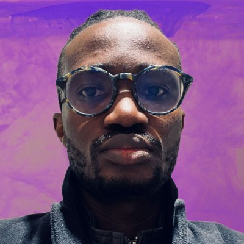

# Our Story

## About Peter Ayeni

Peter Ayeni is a dynamic and committed individual leveraging technology and innovation for the greater social good. He is the proud founder of FuelMyHustle and currently serves as a Senior Software Engineer at Netacea in Manchester, UK.

Peter holds a diverse educational background. He received a Diploma in Computing from Informatics Education Singapore, a Bachelor of Business Administration (BBA) in IT Security from SMC Switzerland, and completed an Executive Education program in Business & Entrepreneurship at the esteemed Kellogg Business School.

His work has earned him prestigious fellowships such as The DO School Fellowship and the Mandela Washington Fellowship. Peter also has the honor of being a winner of the Union Bank Centenary Innovation Challenge.

An avid lifelong learner, Peter has a deep-rooted passion for helping the next generation find their footing in both the tech industry and social entrepreneurship. His contributions to the field exemplify his dedication and enthusiasm for technological advancements and societal development.

## My Tech Journey

Straight out of high school, I was propelled into the tech world. My dream was to study software engineering, but unfortunately, no school in Nigeria offered the course at that time. High fees made alternative vocational schools like NIIT inaccessible to me, so I resorted to self-education.

Starting from the very basics, I learned about computer repairs and networking. I secured my first job at a cyber cafe with a modest monthly wage of N6,500. With a few free browsing hours at my disposal, I seized the opportunity to download resources on graphics and web design, archiving them on CDs for later study.

Gradually, I honed my skills in Corel Draw for graphics and Macromedia Dreamweaver for web design. I also familiarized myself with Microsoft Front Page and SwisMax. While my day job in hardware and networking paid the bills, I kept enhancing my abilities in graphics and web design. After developing some proficiency and delivering a few side projects, I landed my first web design job. In 2007, I hosted my first website at the very same cyber cafe.

Feeling confident in my skills, I resigned from the cyber cafe job and started my own company, offering graphic and web design services. As Adobe bought Macromedia, I began learning Photoshop, which significantly improved my design skills. Expanding my services, I not only designed for clients but also assisted them with high-quality prints, thus inviting more business opportunities.

About five years post high school, I had a thriving small business but no formal degree. Having saved enough, I found an international school offering a course in computing. I enrolled, studied diligently, and graduated with distinction with an International Diploma in computing. A classmate then recommended me to YALIAM Press, and I was interviewed during my final semester. I received a job offer and joined the company immediately after completing my final project.

At YALIAM, my starting salary as a Graphic Artist was N45,000. However, my wide array of IT skills proved beneficial to the company. Besides graphic design, I took on building and maintaining the company's IT infrastructure. I also developed the company's official website and internal software, which led to a salary hike and a series of promotions. During this time, I pursued an online degree with SMC Switzerland and, after four fruitful years at YALIAM, I decided to move on.

Subsequently, YIAGA approached me to serve as a Media and Communication consultant. After a productive three months, they offered me a full-time role. Meanwhile, a side project I had been nurturing began to gain traction. I resigned from YIAGA to dedicate myself fully to this venture, which won me several national and international awards. I also received offers and scholarships to study abroad and was selected for various fellowships that profoundly influenced my life.

Finally, in 2019, thirteen years after embarking on my journey in tech, I received an offer to study Software Engineering at the Flatiron School in London, United Kingdom. Despite numerous challenges along the way, I got my first role in the UK as a Software Engineer just about 2 months into the progamme, and my professional journey as a Software Engineer began.

## Why Tech Clarity Coach

"I firmly believe that there has never been a better time to enter the tech industry than now. Reflecting on my own journey, which began 15 years ago, I wish I had access to a platform like the one we have today. The vast online resources currently available can equip anyone with tech skills and pave the way to gainful employment.

However, the abundance of information can be overwhelming. It's easy to feel lost in this vast ocean of resources. This is why I created Tech Clarity Coach.

Tech Clarity Coach is designed to navigate you through this complex landscape. It provides quality resources, comprehensive guides, and essential support. From acquiring valuable skills to searching and landing a job, and even further professional development in your tech career, Tech Clarity Coach is here to make your journey less daunting and more rewarding."

## Team Members
