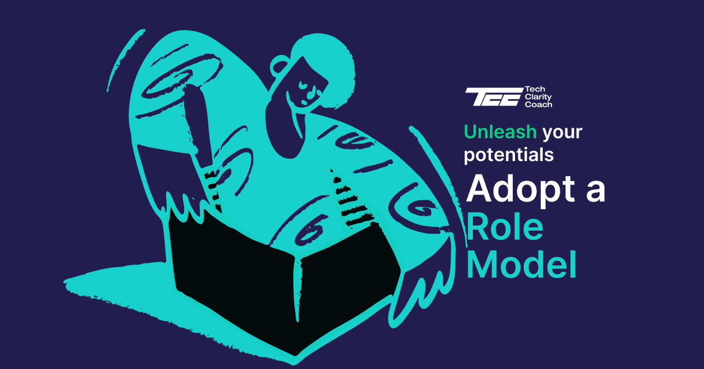

# You don't need Mentors adopt an Heroe(s)

import Heroes from "@components/heroescard";

## Navigating the Boundaries of Mentorship in Tech

For many tech novices, securing personalized mentorship appears to be the ideal path for career development. They envisage experienced mentors laying out clear roadmaps and providing guidance through the intricate terrain of the tech industry. However, the reality is often quite different. Many potential mentors are active employees or founders, and their time constraints often limit the feasibility of one-on-one mentorship.

## Adopting Role Models over Traditional Mentorship

In light of this, aspiring tech professionals should consider an alternative approach. Instead of relying solely on direct, personalized mentorship, we encourage mentees to observe and learn from these experienced professionals from a distance. Their public activities, statements, and engagements can serve as valuable sources of insight and inspiration.

## The Need for Tech Heroes and Role Models

One of the key objectives of our project is to bridge this gap and guide aspiring tech professionals towards this more sustainable, realistic approach to mentorship. We aim to provide access to curated role models who, despite not being available for direct, one-on-one mentorship, can still provide valuable guidance.

## The Power of Social Learning in Tech

By following these mentors on social media and other public forums, mentees can absorb daily growth tips and insights. By applying these lessons in their own careers, they emulate the success strategies laid out by their chosen role models. This approach accelerates growth and enables mentees to progress without the need for traditional mentorship. Instead of waiting for a mentor's availability, they proactively build their own paths by learning from the best in the field.

## Heroes

<Heroes />
